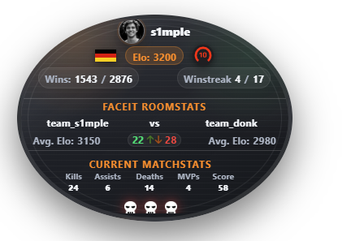
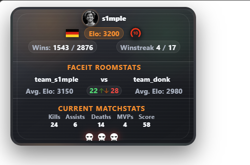

# RadarOverlay CS2
RadarOverlay displays live CS2 and Faceit data as a browser overlay for OBS. The application includes a setup page where you can store your Faceit token, configure CS2 Game State Integration, and copy the correct OBS URLs directly.

# Preview

## Using the Release Build

The finished Windows build is placed in the `release` on the right side.
1. Download the release and unzip it.
1. Start `RadarOverlay.exe`.
2. Open `http://localhost:3001` in your browser if the page does not open automatically.
3. Enter your Faceit Bearer token on the setup page.
4. Let the app detect your CS2 config folder and click `Write GSI file`.
5. Add an OBS browser source with one of these URLs:
   - `http://localhost:3001/overlay` for 16:9
   - `http://localhost:3001/overlay?res=43` for 4:3

Preview mode without a live match is available with `?demo=1`, for example:
`http://localhost:3001/overlay?demo=1`

## Faceit Token
Create your token at [developers.faceit.com/apps](https://developers.faceit.com/apps).
The application stores your settings locally at:
`%APPDATA%\RadarOverlay\settings.json`

## CS2 Game State Integration

The app tries to find your CS2 config folder automatically and writes `gamestate_integration_radaroverlay.cfg` into it.
Typical target folder:
`...\Steam\steamapps\common\Counter-Strike Global Offensive\game\csgo\cfg`

## OBS
Recommended browser source settings:

- URL: `http://localhost:3001/overlay`
- Resolution: `1920x1080`

For 4:3 use:
- URL: `http://localhost:3001/overlay?res=43`
